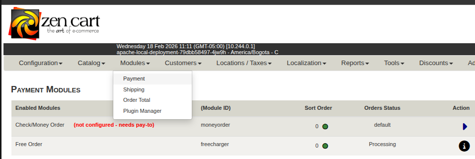
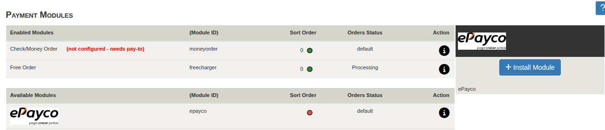
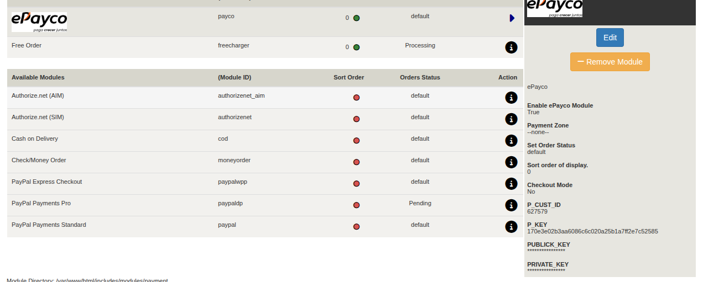

#ePayco plugin para ZenCart v1.5.1

**Si usted tiene alguna pregunta o problema, no dude en ponerse en contacto con nuestro soporte técnico: desarrollo@payco.co.**

## Tabla de contenido

* [Requisitos](#requisitos)
* [Instalación](#instalación)
* [Configuración](#configuración)
* [Pasos](#pasos)
* [Versiones](#versiones)

## Requisitos

* Tener una cuenta activa en [ePayco](https://pagaycobra.com).
* Tener instalado ZenCart v1.5.1 o superior.
* Acceso a las carpetas donde se encuetra instalado ZenCart.

## Instalación

1. [Descarga el plugin.](https://github.com/epayco/Plugin_ePayco_ZenCart/releases/tag/1.5.1)
2. Copie los archivos `confirmacion.php` y `checkout_process_pol.php` en el directorio raíz de ZenCart.

3. Copie los archivos de la carpeta `includes` manteniendo la estructura de directorios:
   
   - Navegue por cada subdirectorio dentro de la carpeta `includes` del plugin
   - Copie cada archivo a la ubicación correspondiente en su instalación de ZenCart, **respetando la misma estructura de carpetas**
   
   **Ejemplo:** Para el archivo `define_checkout_success.php`:
   
   - **Ubicación en el plugin:**  
     `PluginPayco/includes/languages/english/html_includes/classic/define_checkout_success.php`
   
   - **Destino en ZenCart:**  
     `ZenCart/includes/languages/english/html_includes/classic/define_checkout_success.php`
   
   > **Nota:** Aplique este mismo procedimiento para todos los archivos dentro de la carpeta `includes`, manteniendo siempre la estructura de subdirectorios original.
	

## Configuración

1. Para configurar el Plugin de ePayco, ingrese al administrador de Zen cart, ubique la sección Modules en el menú principal, despliegue las opciones y haga clic sobre la opción Payment.
2. En la sección payment, podrá ver los módulos de pago actuales, entre ellos ePayco, haga clic en el logo de ePayco, para desplegar el botón Install y presiónelo.
3. Configure los siguientes campos:

	* **ID USUARIO**: Es el ID o Número de usuario que es generado por el sistema de ePayco.
	* **LLAVE SECRETA**: Esta llave la puede encontrar ingresando por su módulo administrativo de ePayco.
	* **URL DE LA PASARELA**: por defecto está apuntando al servidor en producción de la pasarela, no es necesario cambiarlo.

	Al finalizar presione el botón Update para guardar los cambios, ahora el método de pago es visible para los usuarios, en el carrito de compras.

## Pasos

## Versiones
* [ePayco plugin ZenCart v1.5.1](https://github.com/epayco/Plugin_ePayco_ZenCart/releases/tag/1.5.1).

* [ePayco plugin ZenCart v2.0.0](https://github.com/epayco/Plugin_ePayco_ZenCart/releases/tag/2.0.0).